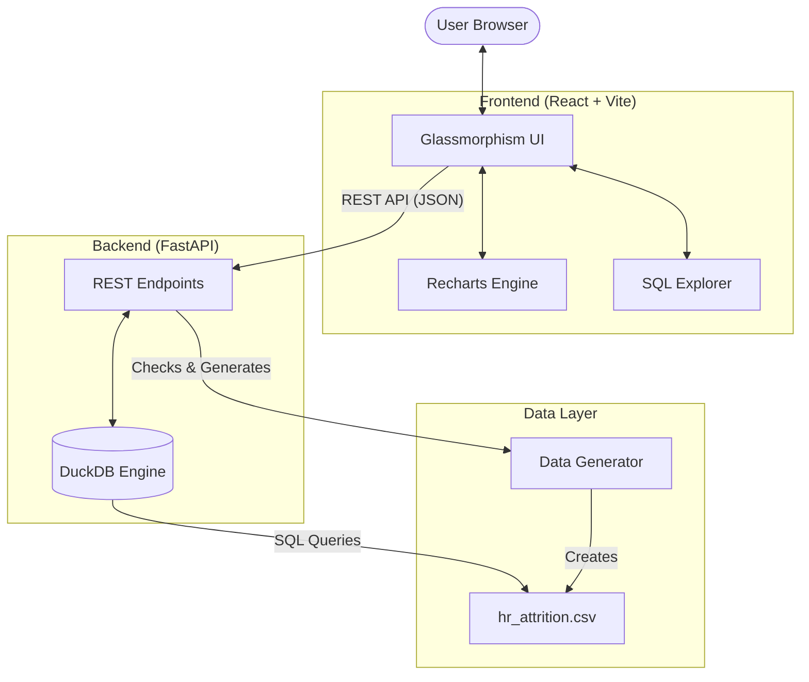

# 🏗️ System Architecture

This document outlines the technical architecture of the HR Attrition Dashboard, a full-stack analytical application designed for high-performance SQL execution and interactive visualization.

## 🏛️ High-Level Overview

The application follows a modern decoupled architecture, optimized for containerized deployment (Docker) on platforms like Hugging Face Spaces.

---

## 🛠️ Component Breakdown

### 1. Data Layer (DuckDB + CSV)
- **Engine**: [DuckDB](https://duckdb.org/) serves as the core analytical engine. It operates in-process, reading directly from the `hr_attrition.csv` file.
- **Why DuckDB?**: It provides a columnar storage format at runtime, enabling efficient execution of advanced SQL (CTEs and Window Functions) without the overhead of a traditional database server.
- **Portability**: The entire data layer is self-contained within the application container.

### 2. Backend API (FastAPI)
- **Framework**: [FastAPI](https://fastapi.tiangolo.com/) provides high-performance asynchronous endpoints.
- **SQL Showcase**: The backend doesn't just return data; it also returns the raw SQL strings used for each query, which the frontend displays in the **SQL Explorer**.
- **Startup Logic**: On application start, a check is performed for the CSV file. If missing, a data generator script creates a synthetic dataset (1,470 records) to ensure the app is immediately functional.

### 3. Frontend Dashboard (React)
- **Visuals**: Powered by [Recharts](https://recharts.org/), providing smooth, interactive SVG charts.
- **State Management**: Uses React Hooks (`useState`, `useEffect`) for lightweight data fetching and UI state (like the collapsible SQL viewer).
- **Styling**: Vanilla CSS with CSS Variables for a "Glassmorphism" effect, featuring semi-transparent backgrounds and heavy blurs.

---

## 🔄 Data Workflow

1.  **Request**: The user loads the dashboard; the React app sends 8 parallel requests to the FastAPI backend.
2.  **Execution**: FastAPI receives the requests and invokes the DuckDB engine.
3.  **SQL Processing**:
    -   DuckDB loads the CSV into a temporary table in memory.
    -   Executes the specific **CTE** or **Window Function**.
    -   Converts the result set into a Pandas DataFrame, then to JSON.
4.  **Response**: The backend returns the analytical data + the SQL query string.
5.  **Rendering**: Recharts maps the JSON data to visual elements; the SQL Explorer updates its display.

---

## 🐳 Deployment & CI/CD

-   **Environment**: Dockerized (multi-stage build).
-   **Sync**: A GitHub Action (`sync_to_hf.yml`) automatically pushes code to Hugging Face Spaces on every commit to `main` (excluding `.md` changes).
-   **Host**: Hugging Face Spaces runs the Docker container, exposing the app on port **7860**.
